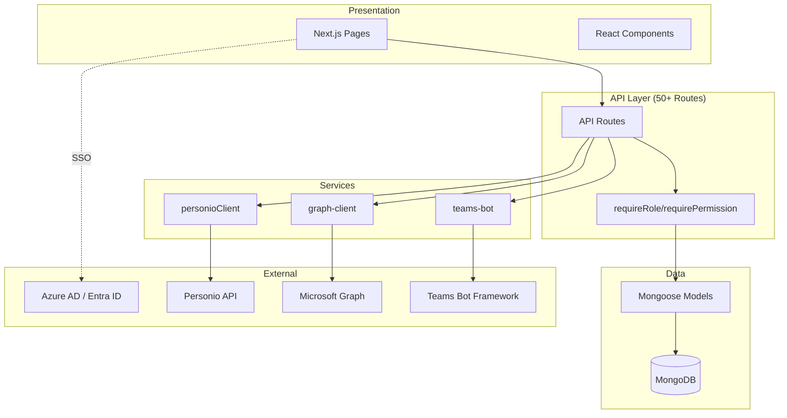
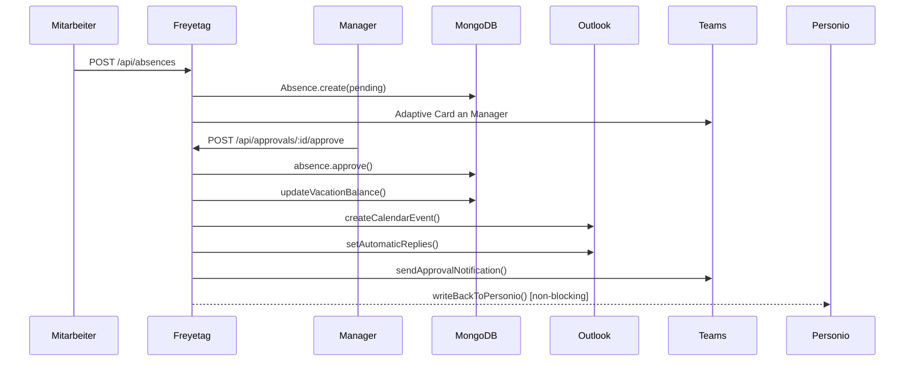
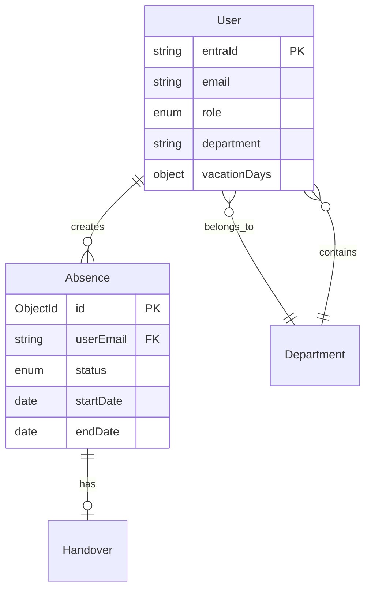
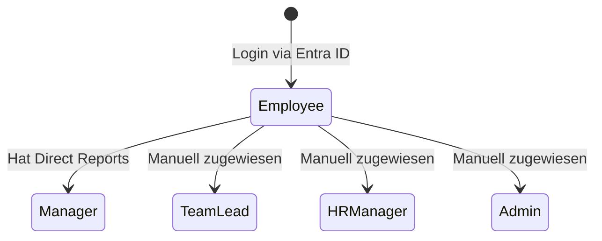
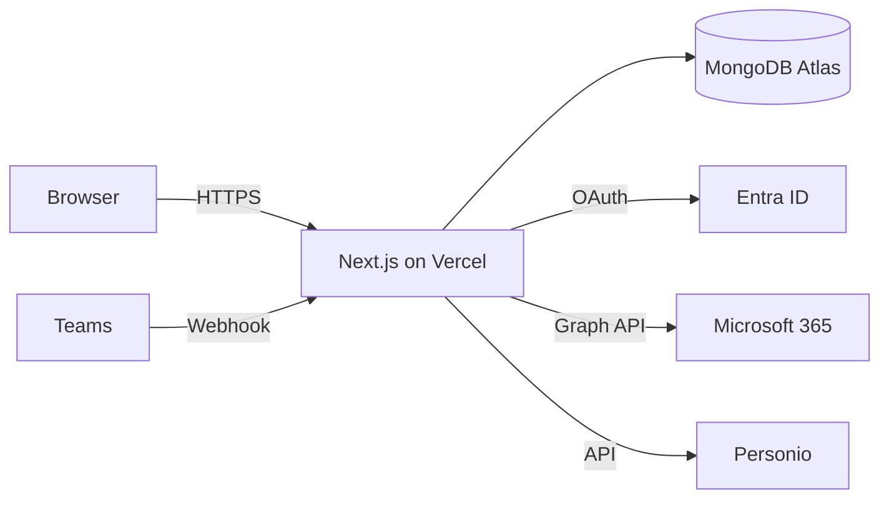

# Freyetag Documentation Generator (with Diagrams)

## When to use this skill
- Creating or updating documentation
- Generating architecture diagrams from code
- Visualizing API flows, approval chains, data models
- Explaining complex code visually
- Keywords: document, docs, README, diagram, visualize, architecture, flow, explain

## MCP Tools available

This skill uses two MCP Mermaid servers:

### mcp-mermaid (Rendering)
- Renders Mermaid code to SVG/PNG files
- Use for: Final export of diagrams to docs/diagrams/

### mermaid-server (Code Analysis + Generation)
- Analyzes source code and generates diagrams automatically
- Tool: `generate_diagram_from_code` — give it source code, get a diagram
- Tool: `create_workflow_diagram` — describe a process, get a flowchart
- Tool: `analyze_diagram` — improve existing diagrams
- Tool: `export_diagram_formats` — export to SVG/PNG/PDF

## Diagram types for Freyetag

### 1. Architecture Overview
Generate from codebase structure. Use `generate_diagram_from_code` with src/app/api/ and src/lib/.


### 2. Approval Flow (Sequence Diagram)
Generate from src/app/api/approvals/[id]/approve/route.ts:


### 3. Data Model (ER Diagram)
Generate from src/models/:


### 4. RBAC State Diagram


### 5. Deployment Architecture


## Documentation structure

### docs/ARCHITECTURE.md
Embed diagrams with: ``
Sections: System Overview, Data Flow, Data Model, RBAC, Deployment

### docs/API.md
For each route: Method, Path, Auth, Description, Body, Response, Errors.
Group by: Absences, Approvals, Admin, Analytics.
Embed sequence diagrams for complex flows.

### docs/SETUP.md
Prerequisites, Azure AD setup, MongoDB, env vars, first run, admin creation.

### README.md
Hero diagram, features, quick start, links to docs.

## Commands for scanning
```bash
# Route inventory
for f in $(find src/app/api -name "route.ts" | sort); do
  methods=$(grep -o "export async function [A-Z]*" "$f" | awk '{print $4}')
  route=$(echo $f | sed 's|src/app||;s|/route.ts||;s|\[|{|g;s|\]|}|g')
  echo "$methods $route"
done

# Model inventory
for f in src/models/*.ts; do echo "=== $(basename $f .ts) ==="; grep -E "type:|required:|enum:" "$f" | head -10; done

# Env vars used
grep -rn "process.env\." src/ --include="*.ts" | grep -v node_modules | sed 's/.*process\.env\.\([A-Z_]*\).*/\1/' | sort -u
```

## Style guide for diagrams
- German labels (Mitarbeiter, Genehmigung, Urlaubsantrag)
- Max 15-20 nodes per diagram
- Save as SVG to docs/diagrams/
- Naming: kebab-case (architecture-overview.svg, approval-flow.svg)
