# Absence Management App (Freyetag)

A modern, enterprise-grade solution for managing employee absences, holiday requests, and handovers. Built with Next.js, and strictly integrated with Microsoft 365 (Entra ID, Microsoft Graph, and Teams).

---

## 🌟 Key Features
- **SSO Authentication**: Sign in with Microsoft Entra ID (Azure AD).
- **Holiday Requests**: Simple, intuitive flow for creating and managing vacation requests.
- **Manager Approval**: Managers receive real-time notifications in Microsoft Teams with Adaptive Cards.
- **M365 Integration**:
  - Automatic **Outlook Calendar** events upon approval.
  - Automatic **Outlook Auto-Replies** (Out-of-office) setup.
  - **Teams Bot** notifications for approvals and handovers.
- **Handover Management**: Detailed task handover for substitutes, integrated into the request flow.
- **Enterprise RBAC**: Granular roles (Employee, Team Lead, Manager, HR Manager, Admin).
- **External Sync**: Two-way synchronization with **Personio** (optional).

---

## 🏗️ Technical Stack
| Category | Technology |
| :--- | :--- |
| **Frontend** | Next.js 14, React, Tailwind CSS, shadcn/ui |
| **Backend** | Next.js API Routes (Serverless) |
| **Database** | MongoDB with Mongoose |
| **Auth** | NextAuth.js (Entra ID Provider) |
| **Integrations** | Microsoft Graph API, Teams Bot Framework, Personio API |

---

## 📚 Documentation
- [**Setup Guide**](./docs/SETUP.md): Instructions for setting up Entra ID, MongoDB, and the development environment.
- [**Architecture Overview**](./docs/ARCHITECTURE.md): Detailed system design, data models, and deployment diagrams.
- [**API Documentation**](./docs/API.md): Endpoint reference and RBAC permission levels.

---

## 🚀 Quick Start
1.  **Clone the repository** and install dependencies: `npm install`.
2.  **Configure environment variables**: Copy `.env.example` to `.env.local` and add your Entra ID and MongoDB credentials.
3.  **Run the development server**: `npm run dev`.
4.  **Open [http://localhost:3000](http://localhost:3000)** and sign in.
