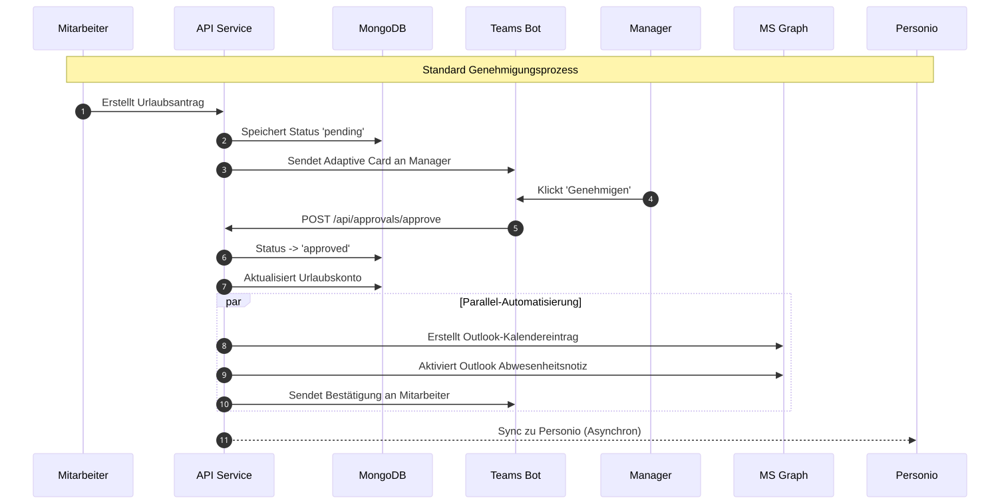

# Systemarchitektur - Freyetag Absence Management

Dieses Dokument beschreibt die technische Architektur, den Datenfluss und das Berechtigungsmodell der Freyetag Abwesenheitsverwaltung.

## 1. Systemübersicht

Die Anwendung ist als moderne Full-Stack Next.js Applikation konzipiert, die eng in das Microsoft 365 Ökosystem integriert ist.

---

## 2. Datenfluss: Genehmigungsprozess

Der Genehmigungsprozess ist hochgradig automatisiert und nutzt Microsoft Teams für proaktive Benachrichtigungen.

---

## 3. Datenmodell (ER Diagramm)

Die Datenhaltung erfolgt in MongoDB (via Mongoose). Kernentitäten sind Benutzer und Abwesenheiten.

---

## 4. Rollenbasiertes Berechtigungsmodell (RBAC)

Das System nutzt ein 5-Rollen-Modell für granulare Zugriffskontrolle.

Die Zugriffsprüfung erfolgt über die zentrale `requireRole` Middleware.

---

## 5. Deployment Architektur

Die Anwendung wird serverlos auf Vercel betrieben, wobei die Datenhaltung in MongoDB Atlas erfolgt.

---

## 6. Smart Engine & Optimierung

Die "Freyetag Smart Engine" verarbeitet Urlaubsdaten, um proaktive Vorschläge zu generieren und Konflikte frühzeitig zu erkennen.

